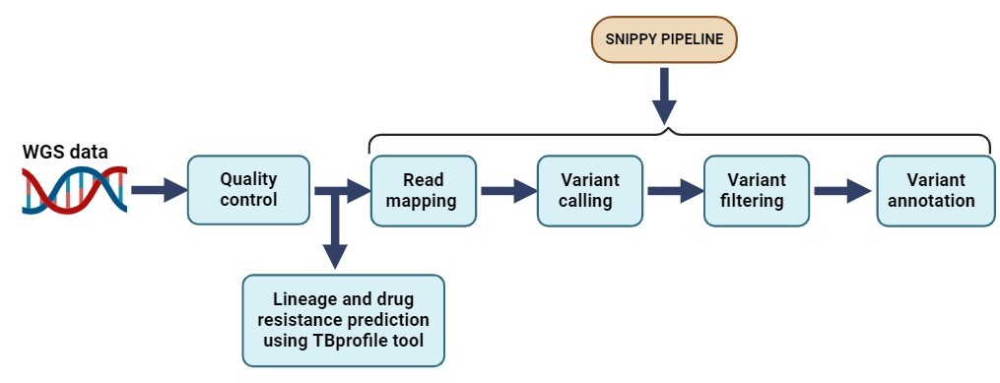
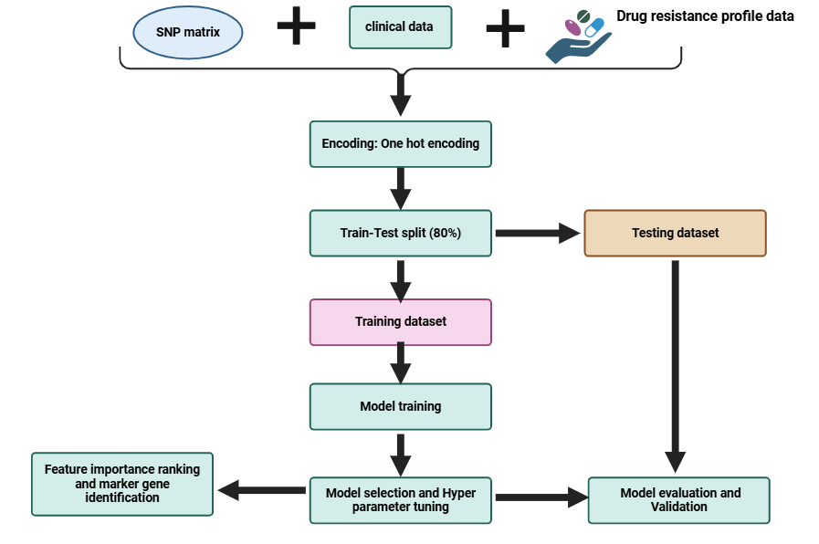

## Machine Learning-based prediction of antibiotic resistance in Mycobacterium tuberculosis clinical isolates from Uganda 
Antimicrobial resistance (AMR) is a growing challenge recognised as global health emergency posing a great threat to modern medicine. 

This repository contains bioinformatics scripts, Jupyter notebooks, and data for training and testing machine learning (ML) algorithms implemented using the Scikit-learn library in Python. A sample ML script for predicting drug resistance to Rifampicin has been provided as a Jupyter notebook file (.ipynb). This format allows users to break down the script into manageable and understandable sections.

## Bioinformatics analysis for the whole genome sequence data
This analysis was performed using various key steps and tools/softwares in the command line.

## Overview of the steps
- Quality control
  1.Quality assessment 
  2.Trimming the reads 
  3.Read taxonomy investigation
- Indexing the reference genome
- Read mapping
- Variant calling
- Variant filtering
- Variant annotation
- Lineage and drug resistance prediction 

**Note** We used the snippy pipeline that does variant calling and also generates a core genome alignment file for phylogenetic tree construction.

## Pre-Requisites

Before running the script, ensure the following **tools** are installed together with their **dependencies**

- `FastQC`
- `Fasterqdump` from the SRAtool kit
- `Trimmomatic`
- `BWA`
- `Samtools`
- `BCFtools`
- `TBProfiler`
- `Snippy`
- `SnpEff`
- `Kraken2`
- `bracken`

### File structure

- `project_reads/`: Directory containing raw sequencing data files `(.fastq.gz)`.
- `Results/' :  Directory for all output results including trimmed reads, QC reports, and analysis results.
- `Kraken2 database` : Kraken database directory such as `minikraken2_v2_8GB_201904_UPDATE`
- `ref` : Directory containing the **reference genome**
- 'Sample_list.txt` : A file containing the list of accession numbers for various samples to be dowloaded from a public repository for analysis.

#### Bioinformatics analysis workflow

### Machine learning (ML) analysis

In the current study, we trained ten machine learning algorithms to predict antimicrobial resistance (AMR) for the antibiotics Rifampicin (RIF), Isoniazid (INH), Ethambutol (EMB), and Streptomycin (STM). The algorithms used include:

1. **Extreme Gradient Boosting classifier (XGBoost)**
2. **Gradient Boosting (GBC)**
3. **Adaptive Boosting (adaboost)**
4. **Logistic Regression (LR)**
5. **Support vector machine (SVM)**
6. **Random Forest (RF)**
7. **Decision Trees (DT)**
8. **Extra Trees Classifier (ETC)**
9. **CatBoost**
10. **Multilayer Perceptron (MLP)**
    
The prediction was based on whole-genome sequencing (WGS) and clinical data (age, sex, and HIV status), with categorical features encoded using one-hot encoding.

**Note**: The SNPmatrix which consisted of genomic variations across the entire genome and the clinica data variables were the  the predictor variables and the phenotypic drug susceptibility testing (DST) data for the drugs was the target variable.

#### ML analysis workflow

### Please cite our article here
Babirye, S.R., Nsubuga, M., Mboowa, G. et al. Machine learning-based prediction of antibiotic resistance in Mycobacterium tuberculosis clinical isolates from Uganda. BMC Infect Dis 24, 1391 (2024). https://doi.org/10.1186/s12879-024-10282-7
